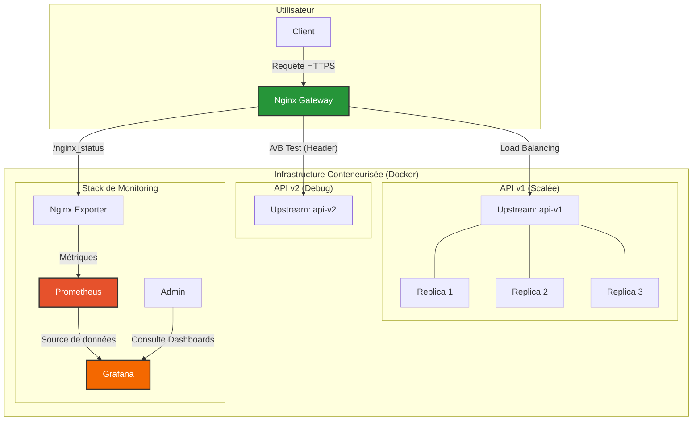
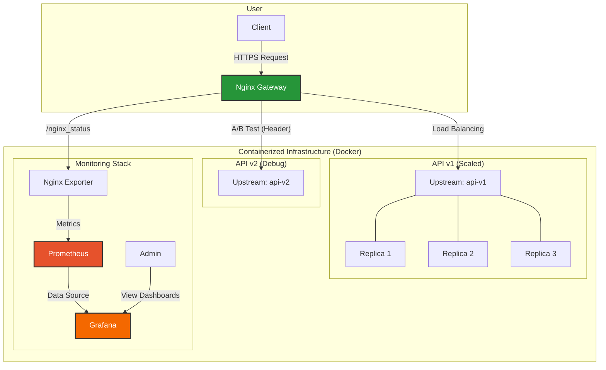

# 🏛️ MLOps Exam Project: Sentiment API Gateway "The Fortress"
### Scalable • Secure • Observable deployment with Nginx + Docker Compose

## 🎭 Tech Stack
🐋 **Docker / Compose** | 🛡️ **Nginx** (Gateway, TLS, Auth, LB, Rate Limit, A/B) | 🐍 **FastAPI** (v1 + v2) | 🔥 **Prometheus** | 📊 **Grafana**

---

## 🎯 What this project demonstrates (Exam Objectives)
This repository implements the exam requirements:

1. **Reverse Proxy**: Nginx is the single entry point for `/predict`.
2. **Load Balancing**: `api-v1` runs as **3 replicas** behind an Nginx upstream.
3. **HTTPS**: TLS termination on Nginx with **self-signed certs**; HTTP redirects to HTTPS.
4. **Access Control**: `/predict` protected by **Basic Auth**.
5. **Rate Limiting**: `/predict` limited to protect the backend.
6. **A/B Testing**: `api-v2` is used **only** when header `X-Experiment-Group: debug` is present.
7. **Monitoring (Bonus)**: Nginx metrics → exporter → Prometheus → Grafana.

---

## 🏗️ Architecture (Requests + Metrics)

~~~text
        [ CLIENT ]
             |
         HTTPS :443
             |
   +---------v----------+
   |  🛡️ NGINX GATEWAY  |
   | TLS / Auth / RL /  |
   | LB / A/B routing   |
   +----+----------+----+
        |          |
        |          +-------------------+
        |                              |
        v                              v
+-------------------+          +-------------------+
| 🐍 api-v1 (x3)    |          | 🐍 api-v2 (debug) |
| load-balanced     |          | header-triggered  |
+-------------------+          +-------------------+


   Metrics (pull-based; internal status is NOT published to host):

             ┌────────────────────────┐
             │ 🎨 Grafana dashboards  │  :3000
             │ queries Prometheus API │
             └───────────┬────────────┘
                         │ Prometheus query API (READ)
                         v   

                   (1) scrape_interval
        ┌───────────────────────────────────────────┐
        │ 🔥 Prometheus                             │ :9090
        │ schedules scrapes + scrapes reporter      │
        │ + stores time series                      │
        └───────────────┬───────────────────────────┘
                        │  (2) HTTP GET /metrics  (PULL)
                        v
               ┌───────────────────────┐
               │ 📊 nginx_exporter     │  :9113
               │ converts Nginx stats  │
               └───────────┬───────────┘
                           │  (3) HTTP GET /nginx_status (PULL)
                           v
               ┌───────────────────────────┐
               │ 🛡️ NGINX :8081            │
               │ /nginx_status (stub)      │
               │ allow: 127.0.0.1 + RFC1918│
               └───────────────────────────┘

~~~

---

## 📁 Project Structure (high level)

~~~bash
.
├── deployments/
│   ├── nginx/
│   │   ├── Dockerfile
│   │   ├── nginx.conf
│   │   ├── .htpasswd
│   │   └── certs/ (generated locally)
│   └── prometheus/
│       └── prometheus.yml
├── model/
│   └── model.joblib
├── src/
│   └── api/
│       ├── requirements.txt
│       ├── v1/ (FastAPI app + Dockerfile)
│       └── v2/ (FastAPI app + Dockerfile)
├── tests/
│   └── run_tests.sh
├── docker-compose.yml
├── Makefile
~~~

---

## 🚀 Quick Start

### 1) Generate TLS certificates (self-signed)
~~~bash
make gen-certs
~~~

### 2) Start the full stack (includes api-v1 scaled to 3)
~~~bash
make start-project
make links
~~~

### 3) Run the exam validation - expected all green of course ;-)  
~~~bash
make test
~~~

### 4) Stop everything
~~~bash
make stop-project
~~~

---

## 🔐 API Usage

### ✅ Default call (routes to v1)
~~~bash
curl -s -X POST "https://localhost/predict" \
  --cacert ./deployments/nginx/certs/nginx.crt \
  --user admin:admin \
  -H "Content-Type: application/json" \
  -d '{"sentence": "Oh yeah, that was soooo cool!"}'
~~~

### 🧪 A/B debug route (forces v2)
~~~bash
curl -s -X POST "https://localhost/predict" \
  --cacert ./deployments/nginx/certs/nginx.crt \
  --user admin:admin \
  -H "X-Experiment-Group: debug" \
  -H "Content-Type: application/json" \
  -d '{"sentence": "Oh yeah, that was soooo cool!"}'
~~~

---

## 🚦 Rate limiting behavior (expected)
A burst of requests should produce a mix of **200** and **503** once the limit is exceeded.  
The automated test suite (`make test`) includes a burst step and checks that the service remains available.

---

## 📊 Monitoring (Bonus)

- **Exporter**: http://localhost:9113/metrics  
- **Prometheus**: http://localhost:9090  
- **Grafana**: http://localhost:3000  (admin / admin)

In Prometheus, check `/targets` → exporter should be **UP**.

---

## ✅ Make targets (most useful)

- `make start-project` — build + start full stack (api-v1 scaled to 3)
- `make stop-project` — stop stack
- `make test` — run `tests/run_tests.sh` (grader entry point)
- `make logs` — follow logs
- `make links` — print local URLs

---

## ⚖️ Notes on portability (why the Nginx allowlist is broad in /nginx_status (see nginx.config)
The internal-only metrics endpoint (`listen 8081` → `/nginx_status`) is **not published to the host**. It is meant to be reachable **only inside the Docker network** (for the exporter), not from the public/host side.

To keep this portable across different Docker/Compose subnets, the allowlist uses RFC1918 private ranges (commonly used by Docker bridge networks) plus loopback:
- 127.0.0.1 (inside-container calls)
- 172.16.0.0/12 and 192.168.0.0/16 (RFC1918 private ranges)

RFC1918 explicitly defines the private blocks, including **172.16/12**, and **192.168/16**:
https://www.rfc-editor.org/rfc/rfc1918.txt

---


# APPENDIX: Original Exam Brief:

## Instructions pour l'Examen / Exam Instructions

<details>
<summary>🇫🇷 Version Française</summary>

### Examen MLOps : Déploiement Avancé avec Nginx 🚀

#### Contexte

Pour cet examen, vous allez mettre en œuvre une architecture MLOps robuste et sécurisée. Le cœur du projet est d'utiliser Nginx comme une API Gateway pour servir un modèle de Machine Learning via une API FastAPI. Vous devrez non seulement rendre le service fonctionnel, mais aussi implémenter des fonctionnalités avancées essentielles en production : scalabilité, sécurité, et stratégies de déploiement modernes.

#### Objectifs du Projet

Votre mission est de configurer une architecture conteneurisée complète qui remplit les objectifs suivants :

1.  **Proxy Inverse (Reverse Proxy)** : Nginx doit agir comme le seul point d'entrée et router le trafic vers les services API appropriés.

2.  **Équilibrage de Charge (Load Balancing)** : L'API principale (`api-v1`) doit être déployée en plusieurs instances (3 répliques) pour garantir la haute disponibilité et la répartition de la charge.

3.  **Sécurité HTTPS** : Toutes les communications externes doivent être chiffrées via HTTPS. Vous générerez des certificats auto-signés pour cela. Le trafic HTTP simple devra être automatiquement redirigé vers HTTPS.

4.  **Contrôle d'Accès** : L'accès au point de terminaison de prédiction (`/predict`) doit être protégé par une authentification basique (nom d'utilisateur / mot de passe).

5.  **Limitation de Débit (Rate Limiting)** : Pour protéger l'API contre les surcharges, l'endpoint `/predict` doit limiter le nombre de requêtes (ex: 10 requêtes/seconde par IP).

6.  **A/B Testing** : Vous déploierez deux versions de l'API.
    *   `api-v1` : La version standard.
    *   `api-v2` : Une version "debug" qui retourne des informations supplémentaires.
    *   Nginx devra router le trafic vers `api-v2` **uniquement si** la requête contient l'en-tête HTTP `X-Experiment-Group: debug`. Sinon, le trafic doit aller vers `api-v1`.

7.  **Monitoring (Bonus)** : Mettre en place une stack de monitoring avec Prometheus et Grafana pour collecter et visualiser les métriques de Nginx.

#### Architecture Cible

Le schéma suivant illustre l'architecture complète que vous devez construire. Nginx sert de passerelle centrale, gérant le trafic vers les différentes versions de l'API et exposant les métriques pour le monitoring.



#### Structure Cible du Projet

Voici l'arborescence de fichiers que vous devez obtenir à la fin :

```sh
. 
├── Makefile
├── README.md
├── README_student.md
├── data
│   └── tweet_emotions.csv
├── deployments
│   ├── nginx
│   │   ├── Dockerfile
│   │   ├── certs
│   │   │   ├── nginx.crt
│   │   │   └── nginx.key
│   │   └── nginx.conf
│   └── prometheus
│       └── prometheus.yml
├── docker-compose.yml
├── model
│   └── model.joblib
├── src
│   ├── api
│   │   ├── requirements.txt
│   │   ├── v1
│   │   │   ├── Dockerfile
│   │   │   └── main.py
│   │   └── v2
│   │       ├── Dockerfile
│   │       └── main.py
│   └── gen_model.py
└── tests
    └── run_tests.sh
```

#### Livrables

Vous devez soumettre une archive `.zip` ou `.tar.gz` contenant l'intégralité de votre projet, incluant :

-   **Tous les `Dockerfiles`** nécessaires pour construire les images de vos services.
-   Le fichier **`docker-compose.yml`** orchestrant tous les services (Nginx, api-v1, api-v2, monitoring).
-   Le fichier **`nginx.conf`** complet avec toutes les directives requises.
-   Les fichiers de configuration et de sécurité (`.htpasswd`, certificats SSL, `prometheus.yml`).
-   Le code source des deux versions de l'API.
-   Un **`Makefile`** avec des commandes claires pour `start-project`, `stop-project`, et `test`.
-   Un script de test (`tests/run_tests.sh`) qui valide automatiquement les fonctionnalités clés.

#### Critères d'Évaluation

**Important :** La validation finale de votre projet se fera en exécutant la commande `make test`. Celle-ci doit s'exécuter sans erreur et tous les tests doivent passer avec succès.

-   **Fonctionnalité** : Toutes les fonctionnalités (de 1 à 6) sont implémentées et fonctionnent correctement.
-   **Qualité du Code** : Les fichiers de configuration (`nginx.conf`, `docker-compose.yml`) sont clairs, commentés si nécessaire, et bien structurés.
-   **Reproductibilité** : Le projet peut être lancé sans erreur avec `make start-project`.
-   **Automatisation** : Le `Makefile` et le script de test sont efficaces et permettent de valider le projet facilement.
-   **Clarté de la Documentation** : Le `README.md` principal explique clairement l'architecture et l'utilisation du projet.

Bon courage ! 🚀

</details>

<details>
<summary>🇬🇧 English Version</summary>

### MLOps Exam: Advanced Deployment with Nginx 🚀

#### Context

For this exam, you will implement a robust and secure MLOps architecture. The core of the project is to use Nginx as an API Gateway to serve a Machine Learning model via a FastAPI API. You will not only make the service functional but also implement advanced features essential for production: scalability, security, and modern deployment strategies.

#### Project Objectives

Your mission is to set up a complete containerized architecture that meets the following objectives:

1.  **Reverse Proxy**: Nginx must act as the single point of entry and route traffic to the appropriate API services.

2.  **Load Balancing**: The main API (`api-v1`) must be deployed in multiple instances (3 replicas) to ensure high availability and load distribution.

3.  **HTTPS Security**: All external communications must be encrypted via HTTPS. You will generate self-signed certificates for this purpose. Plain HTTP traffic must be automatically redirected to HTTPS.

4.  **Access Control**: Access to the prediction endpoint (`/predict`) must be protected by basic authentication (username/password).

5.  **Rate Limiting**: To protect the API from overload, the `/predict` endpoint must limit the number of requests (e.g., 10 requests/second per IP).

6.  **A/B Testing**: You will deploy two versions of the API.
    *   `api-v1`: The standard version.
    *   `api-v2`: A "debug" version that returns additional information.
    *   Nginx must route traffic to `api-v2` **only if** the request contains the `X-Experiment-Group: debug` HTTP header. Otherwise, traffic should be routed to `api-v1`.

7.  **Monitoring (Bonus)**: Set up a monitoring stack with Prometheus and Grafana to collect and visualize Nginx metrics.

#### Target Architecture

The following diagram illustrates the complete architecture you need to build. Nginx acts as a central gateway, managing traffic to the different API versions and exposing metrics for monitoring.



#### Target Project Structure

Here is the file tree you should aim to have at the end:

```sh
. 
├── Makefile
├── README.md
├── README_student.md
├── data
│   └── tweet_emotions.csv
├── deployments
│   ├── nginx
│   │   ├── Dockerfile
│   │   ├── certs
│   │   │   ├── nginx.crt
│   │   │   └── nginx.key
│   │   └── nginx.conf
│   └── prometheus
│       └── prometheus.yml
├── docker-compose.yml
├── model
│   └── model.joblib
├── src
│   ├── api
│   │   ├── requirements.txt
│   │   ├── v1
│   │   │   ├── Dockerfile
│   │   │   └── main.py
│   │   └── v2
│   │       ├── Dockerfile
│   │       └── main.py
│   └── gen_model.py
└── tests
    └── run_tests.sh
```

#### Deliverables

You must submit a `.zip` or `.tar.gz` archive containing your entire project, including:

-   **All necessary `Dockerfiles`** to build the images for your services.
-   The **`docker-compose.yml`** file orchestrating all services (Nginx, api-v1, api-v2, monitoring).
-   The complete **`nginx.conf`** file with all required directives.
-   Configuration and security files (`.htpasswd`, SSL certificates, `prometheus.yml`).
-   The source code for both API versions.
-   A **`Makefile`** with clear commands for `start-project`, `stop-project`, and `test`.
-   A test script (`tests/run_tests.sh`) that automatically validates the key features.

#### Evaluation Criteria

**Important:** The final validation of your project will be done by running the `make test` command. It must run without errors, and all tests must pass successfully.

-   **Functionality**: All features (1 through 6) are implemented and work correctly.
-   **Code Quality**: Configuration files (`nginx.conf`, `docker-compose.yml`) are clear, commented where necessary, and well-structured.
-   **Reproducibility**: The project can be launched without errors using `make start-project`.
-   **Automation**: The `Makefile` and test script are effective and allow for easy project validation.
-   **Documentation Clarity**: The main `README.md` clearly explains the project's architecture and usage.

Good luck! 🚀

</details>
